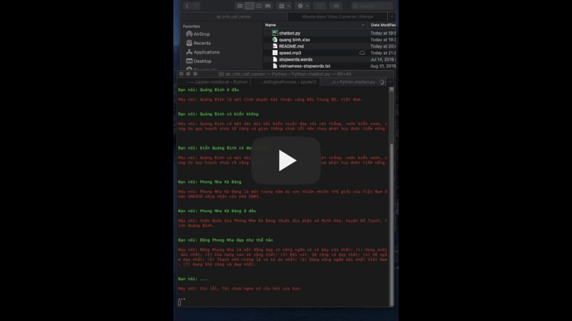

# CHATBOT TỰ ĐỘNG TRẢ LỜI THÔNG TIN CỦA MỘT LĨNH VỰC NHẤT ĐỊNH  

Chatbot này có sử dụng Google API để nhận diện giộng nói và đọc kết quả, tôi tạm gọi là một đài tự động cung cấp thông tin.
Nó có thể ứng dụng để cung cấp thông tin cho một lĩnh vực nhất định, ví dụ nhưng thông tin về một doanh nghiệp, cá nhân, địa phương nào đó ....

